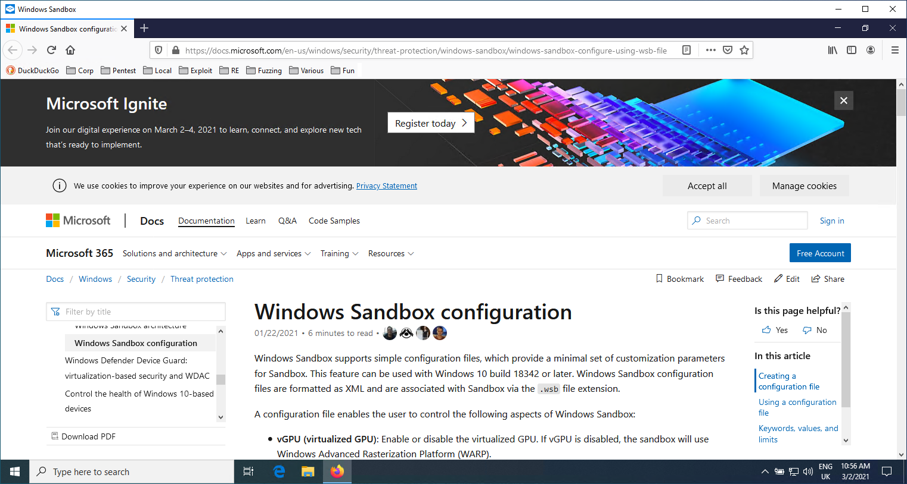

<!-- vim-markdown-toc GFM -->

* [Wubes](#wubes)
    * [Architecture](#architecture)
    * [Prerequisites](#prerequisites)
    * [Usage](#usage)
    * [Tricks](#tricks)
        * [Firefox sandbox](#firefox-sandbox)
* [References](#references)

<!-- vim-markdown-toc -->

# Wubes

Wubes is like [Qubes](https://en.wikipedia.org/wiki/Qubes_OS) but for Windows. The idea is to leverage
the [Windows Sandbox](https://techcommunity.microsoft.com/t5/windows-kernel-internals/windows-sandbox/ba-p/301849) technology to spawn applications in isolation.

We currently support spawning a Windows Sandbox for the following applications:

* Firefox

Other applications could easily be added.

## Architecture

The repository contains the following hierarchy of files and folders:

```
.
├── sandboxes                       // Contains folders shared between the sandboxes and the host
│   ├── Firefox                         // Folder shared between the host and the Firefox sandbox
│   │   ├── abcdefgh.default-release        // Firefox profile copied from the host
│   │   ├── backups                         // Contains a backup of all previous Firefox profiles
│   │   ├── install.bat                     // Install script automatically executed when the Windows Sandbox starts (see below)
│   │   └── save.bat                        // Script to manually execute to save modified Firefox profile onto the host for next Windows Sandbox run
│   └── Firefox.wsb                     // Windows Sandbox profile for Firefox. Double-click to open the sandbox
└── shared
    └── Tools
        └── procexp64.exe
```

## Prerequisites

You need to have Windows 10 Pro or Enterprise and follow the quick start from [here](https://techcommunity.microsoft.com/t5/windows-kernel-internals/windows-sandbox/ba-p/301849).

## Usage

Each application has a Windows Sandbox profile (e.g. `Firefox.wsb`) that defines the host folder where wubes files are (you need to modify it to match your environment), as well as paths inside the Sandbox that will always be the same (no need to modify them).

```xml
<Configuration>
<vGPU>Enable</vGPU>
<Networking>Default</Networking>
<MappedFolders>
   <MappedFolder>
     <HostFolder>C:\path\to\wubes\sandboxes\Firefox</HostFolder>
     <ReadOnly>false</ReadOnly>
   </MappedFolder>
</MappedFolders>
<LogonCommand>
   <Command>C:\users\WDAGUtilityAccount\Desktop\Firefox\install.bat</Command>
</LogonCommand>
</Configuration>
```

When we open the Windows Sandbox Profile (e.g. `Firefox.wsb`), it will automatically call the `install.bat` script to download Firefox, run Firefox once to create an empty profile, then replace the profile with the one from the shared folder and re-run Firefox. For this to work, you first need to copy the Firefox profile you used on your host (e.g. `%APPDATA%\Mozilla\Firefox\Profiles\d63zctv5.default-release`) into `wubes\sandboxes\Firefox\abcdefgh.default-release`. We use hardcoded `abcdefgh` so you don't have to modify internal helper scripts.

You can see the Bookmark toolbar contains all my bookmarks and it re-opened an old tab.



Once we are done browsing the Internet, we can execute the `C:\Users\WDAGUtilityAccount\Desktop\Firefox\save.bat` file from inside the sandbox. That will backup our Firefox profile onto the host. We can then close the Windows Sandbox window.

## Tricks

### Firefox sandbox

You can define your `Downloads` folder to be `C:\users\WDAGUtilityAccount\Desktop\Firefox\Downloads` so you download files directly on your host.

# References

* Windows Sandbox configuration (.wsb): https://docs.microsoft.com/en-us/windows/security/threat-protection/windows-sandbox/windows-sandbox-configure-using-wsb-file
* https://twitter.com/dwizzzleMSFT/status/1354147480951132161